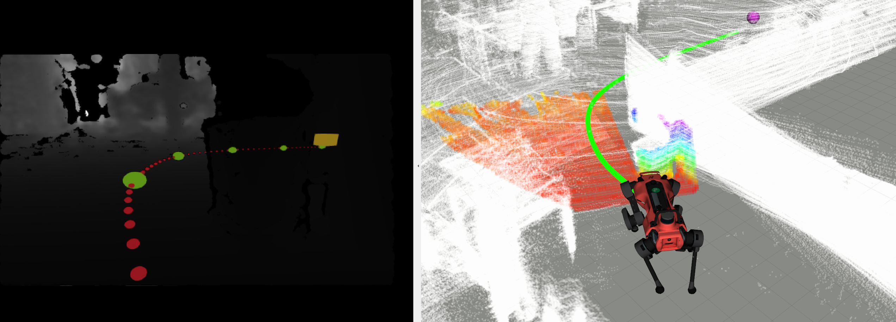

# Imperative Path Planner (iPlanner)

## Overview

Welcome to the [**iPlanner: Imperative Path Planning**](https://arxiv.org/abs/2302.11434) code repository. The iPlanner is trained via an innovative Imperative Learning Approach and exclusively uses front-facing depth images for local path planning. 

A video showing the functionalities of iPlanner is available here: [**Video**](https://youtu.be/QLxnNexEqnU)

**Keywords:** Navigation, Local Planning, Imperative Learning

### License

This code is released under the MIT License.

**Author: Fan Yang 
Maintainer: Fan Yang, fanyang1@ethz.ch**

The iPlanner package has been tested under ROS Noetic on Ubuntu 20.04. This is research code, and any fitness for a particular purpose is disclaimed.

  

## Installation

#### Dependencies

To run iPlanner, you need to install [PyTorch](https://pytorch.org/). We recommend using [Anaconda](https://docs.anaconda.com/anaconda/install/index.html) for installation. Check the official website for installation instructions for Anaconda and PyTorch accordingly.

Please follow the instructions provided in the `INSTALL.md` file to set up your environment and install the necessary packages. You can find the `INSTALL.md` file in the root directory of the project.

#### Simulation Environment Setup

Please refer to the Autonomous Exploration Development Environment repository for setting up the Gazebo simulation Environment: [Website](https://www.cmu-exploration.com/), switch to the branch **noetic_rgbd_camera**.

#### Building

To build the repository and set up the right Python version for running, use the command below:

    catkin build iplanner_node -DPYTHON_EXECUTABLE=$(which python)

The Python3 should be the Python version you set up before with Torch and PyPose ready. If using the Anaconda environment, activate the conda env and check 

    which python

## Training
Go to the **iplanner** folder

    cd <your_imperative_planenr_path>/iplanner

#### Pre-trained Network and Training Data
Download the pre-trained network weights `plannernet.pt` [here](https://drive.google.com/file/d/1UD11sSlOZlZhzij2gG_OmxbBN4WxVsO_/view?usp=share_link) and put it into the **models** folder. Noted this pre-trained network has not been adapted to real-world data.

You can also collect data yourself either inside the simulation environment or in the real-world. Launch the **data_collect_node**

    roslaunch iplanner_node data_collector.launch

Provide the information for the necessary topics listed in `config/data_params.yaml`. The collected data will be put into the folder `data/CollectedData`, and generate folders for different environments that you can specify in `config/data_params.yaml` under **env_name**.

For each of the environments, the data contains the structure of:

    Environment Data
    ├── camera
    |   ├── camera.png
    │   └── split.pt
    ├── camera_extrinsic.txt
    ├── cloud.ply
    ├── color_intrinsic.txt
    ├── depth
    |    ├── depth.png
    │   └── split.pt
    ├── depth_intrinsic.txt
    ├── maps
    │   ├── cloud
    │   │   └── tsdf1_cloud.txt
    │   ├── data
    │   │   ├── tsdf1
    ├── data
    │   │   └── tsdf1_map.txt
    │   └── params
    │       └── tsdf1_param.txt
    └── odom_ground_truth.txt

You can download the example data we provided using the Google Drive link [here](https://drive.google.com/file/d/1bUN7NV7arMM8ASA2pTJ8hvdkc5N3qoJw/view?usp=sharing).

#### Generating Training Data

Navigate to the iplanner folder within your project using the following command:

    cd <<YORU WORKSPACE>>/src/iPlanner/iplanner

Run the Python script to generate the training data. The environments for which data should be generated are specified in the file `collect_list.txt`. You can modify the data generation parameters in the `config/data_generation.json` file.

    python data_generation.py

Once you have the training data ready, use the following command to start the training process. You can specify different training parameters in the `config/training_config.json` file.

    python training_run.py

## Run iPlanner ROS node

Launch the simulation environment without the default local planner

    roslaunch vehicle_simulator simulation_env.launch

Run the iPlanner ROS node without visualization:

	roslaunch iplanner_node iplanner.launch

Or run the iPlanner ROS node with visualization:

    roslaunch iplanner_node iplanner_viz.launch

### Path Following
To ensure the planner executes the planned path correctly, you need to run an independent controller or path follower. Follow the steps below to set up the path follower using the provided launch file from the iplanner repository:

Download the default iplanner_path_follower into your workspace. Navigate to your workspace's source directory using the following command:

    cd <<YOUR WORKSPACE>>/src

Then clone the repository:

    git clone https://github.com/MichaelFYang/iplanner_path_follow.git

Compile the path follower using the following command:

    catkin build iplanner_path_follow

Please note that this repository is a fork of the path following component from [CMU-Exploration](https://www.cmu-exploration.com/). You are welcome to explore and try different controllers or path followers suitable for your specific robot platform.

### Waypoint Navigation
To send the waypoint through Rviz, please download the rviz waypoint plugin. Navigate to your workspace's source directory using the following command:

    cd <<YOUR WORKSPACE>>/src

Then clone the repository:

    git clone https://github.com/MichaelFYang/waypoint_rviz_plugin.git

Compile the waypoint rviz plugin using the following command:

    catkin build waypoint_rviz_plugin

### SmartJoystick

Press the **LB** button on the joystick, when seeing the output on the screen:

    Switch to Smart Joystick mode ...

Now the smartjoystick feature is enabled. It takes the joystick command as motion intention and runs the iPlanner in the background for low-level obstacle avoidance.

## Config files

The params file **`data_params.yaml`** is for data collection

* **vehicle_sim.yaml** The config file contains:
    - **`main_freq`**  The ROS node running frequency
    - **`odom_associate_id`** Depending on different SLAM setup, the odometry base may not be set under robot base frame

The params file **`vehicle_sim.yaml`** is for iPlanner ROS node

* **vehicle_sim.yaml** The config file contains:
    - **`main_freq`**  The ROS node running frequency
    - **`image_flap`** Depending on the camera setup, it may require to flip the image upside down or not
    - **`crop_size`**  The size to crop the incoming camera images
    - **`is_fear_act`** Using the predicted collision possibility value to stop
    - **`joyGoal_scale`** The max distance of goal sent by joystick in smart joystick model

## Reference

If you utilize this codebase in your research, we kindly request you to reference our work. You can cite us as follows:

- Yang, F., Wang, C., Cadena, C., & Hutter, M. (2023). iPlanner: Imperative Path Planning. Robotics: Science and Systems Conference (RSS). Daegu, Republic of Korea, July 2023.

## Author

This codebase has been developed and maintained by [Fan Yang](https://github.com/MichaelFYang). Should you have any queries or require further assistance, you may reach out to him at fanyang1@ethz.ch
